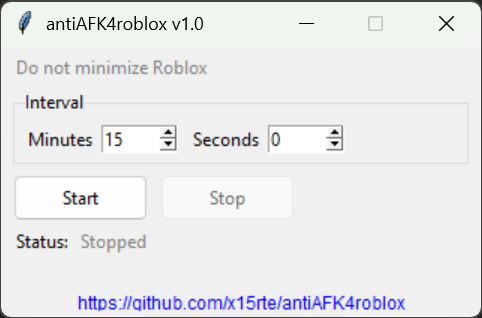

# antiAFK4roblox

This tool periodically locates the Roblox game process, brings the Roblox window to the foreground, and sends the I and O key presses to keep your session active. After the keys are sent, it automatically restores the previously focused window so your workflow is not interrupted.  

If the Roblox window is minimized, the tool will not run the anti-AFK action and will instead warn you to restore the window from the taskbar.

This tool currently supports Windows only.

## Usage

### Method 1
Download and run the latest release from the [Releases page](https://github.com/x15rte/antiAFK4roblox/releases).

### Method 2
```bash
# Install
git clone https://github.com/x15rte/antiAFK4roblox.git
cd antiAFK4roblox/
pip install -r ./requirements.txt

# Run
python ./main.py
```

## Freeze to exe
```bash
pyinstaller --onefile --noconsole --name antiAFK4roblox --hidden-import=win32com.client main.py
```

## Screenshot

